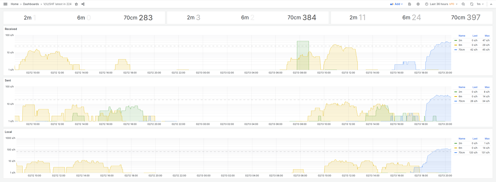

# V/U/SHF exporter

Consume V/U/SHF spots from [mqtt.pskreporter.info](http://mqtt.pskreporter.info/)
and aggregate them for Prometheus' consumption over `METRICS_ADDRPORT`.

In this context, "V/U/SHF" is to be interpreted as 6m, 4m, 2m, 70cm, and 23cm
bands, and at the moment we're only interested in spot counts in the short term,
like a few hours or so. No further filtering is performed, the only labels added
are `country`, `band`, and `mode`, and all modes are considered. The exporter can
obviously be configured to consume whatever bands one wants and
[PSK Reporter](https://pskreporter.info/) provides, not just V, U, and SHF.

Given that there are five
bands by default, and we're looking at two directions for each, we'd have the
following counters for Prometheus to consume. Here, "received" spots are
_received in_ `country`, "sent" spots are _sent from_ `country`; modes observed
will vary but would be expected not to become numerous enough to cause
unwelcome cardinality explosions:

```
pskreporter_spots_received_total{country="224", band="6m", mode="FT8"} 31233
pskreporter_spots_received_total{country="224", band="6m", mode="WSPR"} 9
pskreporter_spots_received_total{country="224", band="4m", mode="FT8"} 7767
pskreporter_spots_received_total{country="224", band="2m", mode="FT8"} 11474
pskreporter_spots_received_total{country="224", band="70cm", mode="FT8"} 11786
pskreporter_spots_received_total{country="224", band="70cm", mode="FT4"} 462
pskreporter_spots_received_total{country="224", band="23cm", mode="FT8"} 20196
pskreporter_spots_sent_total{country="224", band="6m", mode="FT8"} 5541
pskreporter_spots_sent_total{country="224", band="6m", mode="WSPR"} 2
pskreporter_spots_sent_total{country="224", band="4m", mode="FT8"} 2204
pskreporter_spots_sent_total{country="224", band="2m", mode="FT8"} 10374
pskreporter_spots_sent_total{country="224", band="70cm", mode="FT8"} 26363
pskreporter_spots_sent_total{country="224", band="70cm", mode="FT4"} 537
pskreporter_spots_sent_total{country="224", band="23cm", mode="FT8"} 23575
```

"Local" spots, i.e. ones which are sent and received in the same `country`,
are recorded separately:

```
pskreporter_spots_local_total{band="6m",country="224", mode="FT8"} 20071
pskreporter_spots_local_total{band="2m",country="224", mode="FT8"} 22653
pskreporter_spots_local_total{band="4m",country="224", mode="FT8"} 8543
pskreporter_spots_local_total{band="70cm",country="224", mode="FT8"} 19389
pskreporter_spots_local_total{band="23cm",country="224", mode="FT8"} 25922
```

The set of MQTT topics subscribed to with the default set of bands
looks like (sent, received):

```
pskr/filter/v2/6m/+/+/+/+/+/224/+
pskr/filter/v2/4m/+/+/+/+/+/224/+
pskr/filter/v2/2m/+/+/+/+/+/224/+
pskr/filter/v2/70cm/+/+/+/+/+/224/+
pskr/filter/v2/23cm/+/+/+/+/+/224/+
pskr/filter/v2/6m/+/+/+/+/+/+/224
pskr/filter/v2/4m/+/+/+/+/+/+/224
pskr/filter/v2/2m/+/+/+/+/+/+/224
pskr/filter/v2/70cm/+/+/+/+/+/+/224
pskr/filter/v2/23cm/+/+/+/+/+/+/224
```

For details about PSK Reporter's MQTT service, see
[here](http://mqtt.pskreporter.info/).

## Spotlog

In addition to the metrics, there's a web-based view, served over `SPOTLOG_ADDRPORT`,
showing spot details in near real-time. Spots are added to the top of the table in
the order they're received from
[MQTT](http://mqtt.pskreporter.info/),
so occasional out-of-order one is to be expected. Simple filtering is possible; for
example:

```
?bands=2m,70cm&modes=JT65,MSK144&locator=KP20&callsign=OH2
```

A spotlog is running in
[spotlog.async.fi](https://spotlog.async.fi/).

## Configuration

Up-to-date images for amd64, arm64 are available in
[ghcr.io](https://github.com/kahara/vushf-exporter/pkgs/container/vushf-exporter).

All settings go through environment variables, with following defaults:

* BROKER `mqtt.pskreporter.info:1883`
* BANDS `6m,4m,2m,70cm,23cm`
* COUNTRY `224`
* METRICS_ADDRPORT `:9108`
* SPOTLOG_ADDRPORT `:8071`
* SPOTLOG_RETENTION `60h`

## An example

A Docker composition is included, and it runs this repo, Prometheus, and Grafana.
It can be started with:

```console
docker compose -f example-compose.yaml up
```

Then open [localhost:3000](http://localhost:3000), navigate to
[Dashboards](http://localhost:3000/dashboards), and select
[V/U/SHF latest in 224](http://localhost:3000/d/667c54c3-0f26-4f16-817b-9e9b04046633/v-u-shf-latest-in-224?orgId=1&refresh=1m).
It may take some time before spots start appearing, depending.
Spotlog can be accessed over
[localhost:8071](http://localhost:8071).

## Screenshots!

Top row from left to right shows totals for 90m, 3h, and 6h. Y-axis is
logarithmic, and the dashed line shows the 50% waterline. Would be nice if bands were
in frequency order, but that's hardly fatal:



This one shows some daily aliveness on 6m and 2m, plus a
[70cm Nordic Activity Contest](https://oh6zz.com/2024/rules/NAC_2024.htm),
which started at 18UTC, still going on. From the "Local" numbers we can perhaps
come to the conclusion that on average, stations worked other modes for the
first hour or so before switching to digimodes (or more accurately,
[a mode](https://en.wikipedia.org/wiki/FT8)). And that propagation across
country borders is happening.


Here the 70cm contest is over, and things have cooled down somewhat. Previous week's
6m NAC is clearly visible. During the beginning of that 6m contest, the Local spot
count increased more sharply compared to Received and Sent ones, from which we could
(again, perhaps!) infer that some stations in southern Finland initially had their
beams pointing North, then rotated towards West and South after working other OH
stations.
